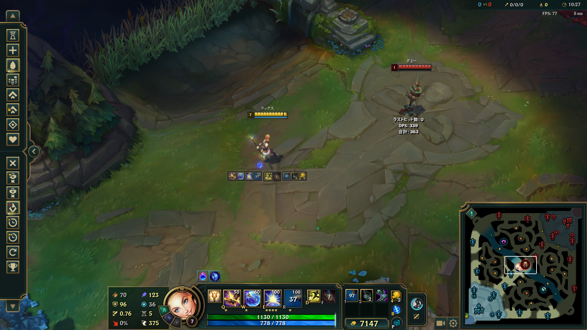
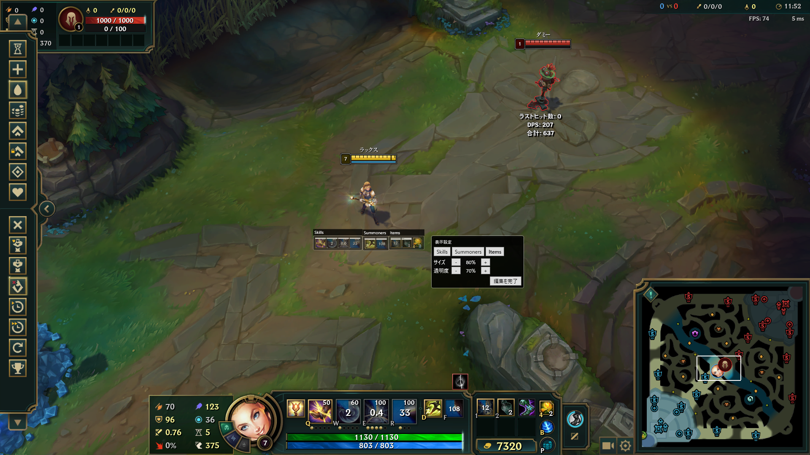
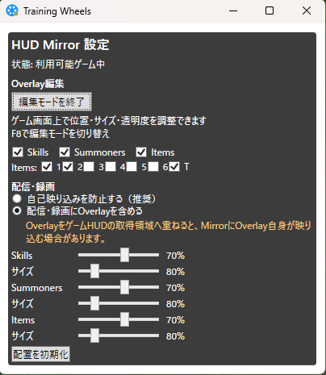

# Training Wheels

Training Wheels is an alpha learning-support overlay for new **League of Legends** players.

It mirrors information already visible in the player's own HUD—Skills, Summoner Spells, and selected item slots—to positions that are easier for the player to see. It does not add information, give real-time action instructions, or automate gameplay.

The goal is to be a temporary set of “training wheels”: players should eventually be able to play without the overlay.

> This is an early alpha release. Supported environments and features are limited.

## Screenshots

The following screenshots are captured in Practice Tool and show the untrimmed game view.

### Overlay during normal play



### Overlay edit mode



### Settings window



## What it can do

- Mirror Skills: Q / W / E / R
- Mirror Summoner Spells: D / F
- Mirror selected Item Slots 1–6 and Trinket
- Independently position Skills, Summoners, and Items
- Turn categories and individual item slots on or off
- Adjust opacity and display scale for each group
- Enter overlay edit mode from the settings window or with F8
- Choose whether the overlay is included in streaming or recording capture

## Quick start

1. Extract the release zip.
2. Start `TrainingWheels.exe`.
3. Start a game in a supported mode.
4. When the overlay appears, adjust it from the settings window or by pressing F8.

Keep every file in the extracted release folder together. Copying only `TrainingWheels.exe` to another location will not work.

The application is designed so that its settings window is sufficient for basic use; this document is reference material rather than a required operating manual.

## When the overlay is shown

The overlay is enabled only when all of the following are true:

```text
Supported game mode
AND the game is in progress
AND the League of Legends game window is detected
```

This is a fail-closed product policy. Unsupported or unknown states do not enable the overlay.

### Supported modes

- Practice Tool
- Custom Blind
- Custom Draft
- Co-op vs. AI
- Swiftplay
- Normal Draft

### Blocked modes

- Ranked
- Clash
- Tournament
- Unknown or unsupported queues

The overlay is also hidden outside a live game, including lobby, matchmaking, Ready Check, Champion Select, and after the game ends.

## Capture modes

The settings window offers two capture modes:

- **Prevent self-capture (recommended):** excludes the overlay from the source HUD capture.
- **Include overlay in streaming/recording:** allows the overlay to appear in captured output. If it overlaps the source HUD capture area, the overlay may capture itself.

## Verified environment and limitations

Verified on:

- Windows x64
- 1920×1080
- League of Legends HUD 100%
- Windows display scale 100%
- Full-screen-sized borderless window

Not yet verified:

- Other resolutions
- HUD or Interface Scale changes
- Windows display scale other than 100%
- Multiple monitors or mixed-DPI environments
- Other window modes
- HUD position/size calibration

## What Training Wheels does not do

- Show enemy-player information
- Give real-time action advice
- Read process memory
- Inject DLLs
- Hook a rendering API
- Send automated input or automate gameplay

## Download

最新版のα版はGitHub Releasesからダウンロードできます。

[Training Wheels v0.2.0-alpha](https://github.com/masosan82/TrainingWheels/releases/tag/v0.2.0-alpha)

The latest alpha release is available from GitHub Releases.

## Documentation

- [Privacy](PRIVACY.md)
- [Alpha terms](TERMS.md)
- [Notices](NOTICE.md)

## Riot Games developer registration

Training Wheels is registered in the Riot Games Developer Portal.

The project is designed to follow Riot Games' developer policies and third-party tool requirements. Registration does not mean that Training Wheels is endorsed, certified, or officially approved by Riot Games.

## Disclaimer

This project is not endorsed by Riot Games and does not reflect the views or opinions of Riot Games or anyone officially involved in producing or managing Riot Games properties.

Riot Games and all associated properties are trademarks or registered trademarks of Riot Games, Inc.
